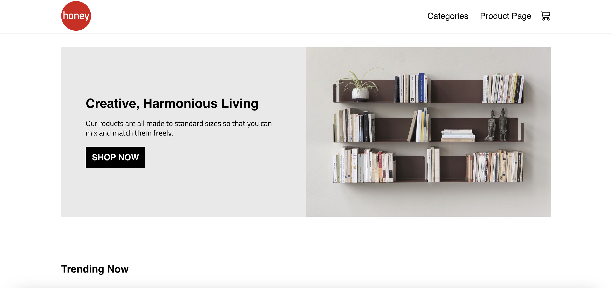
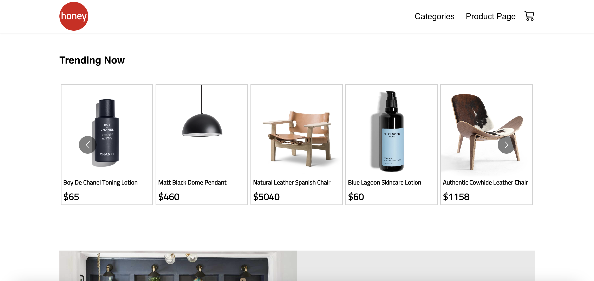
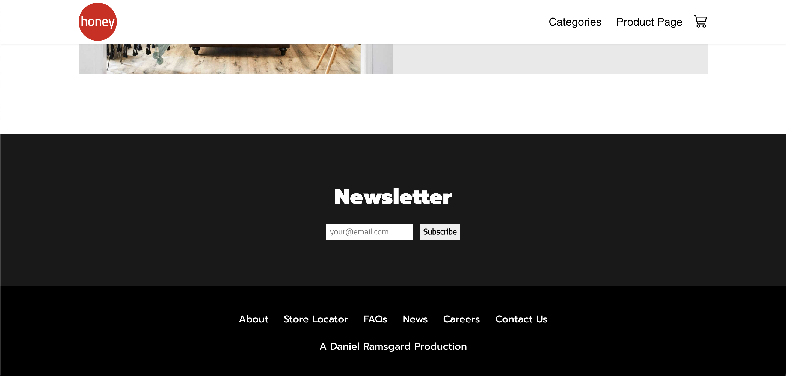
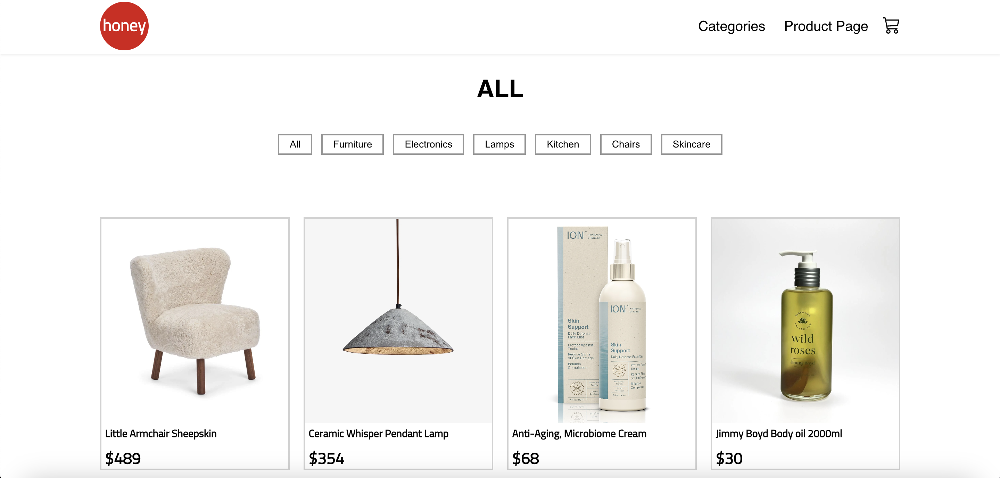
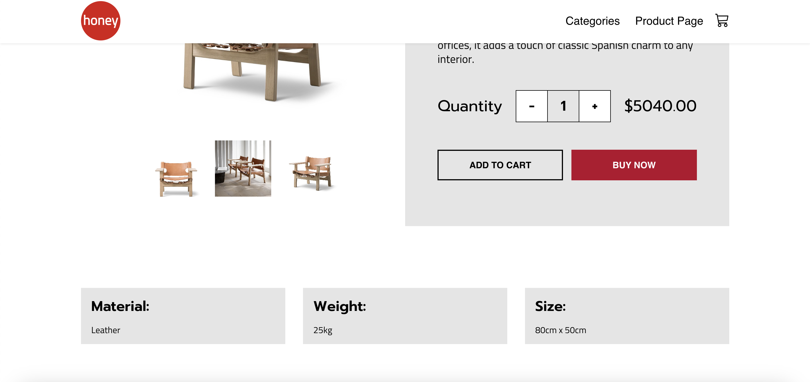
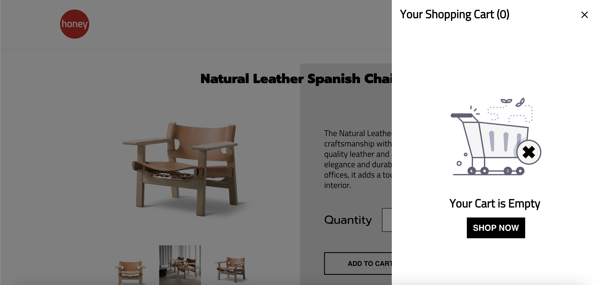
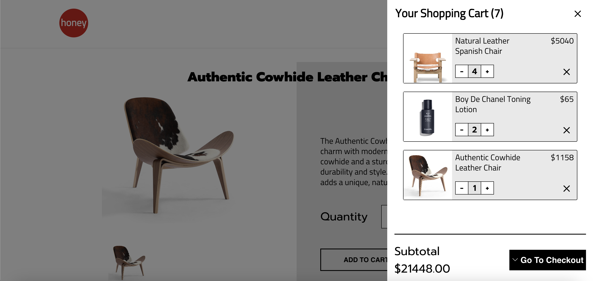
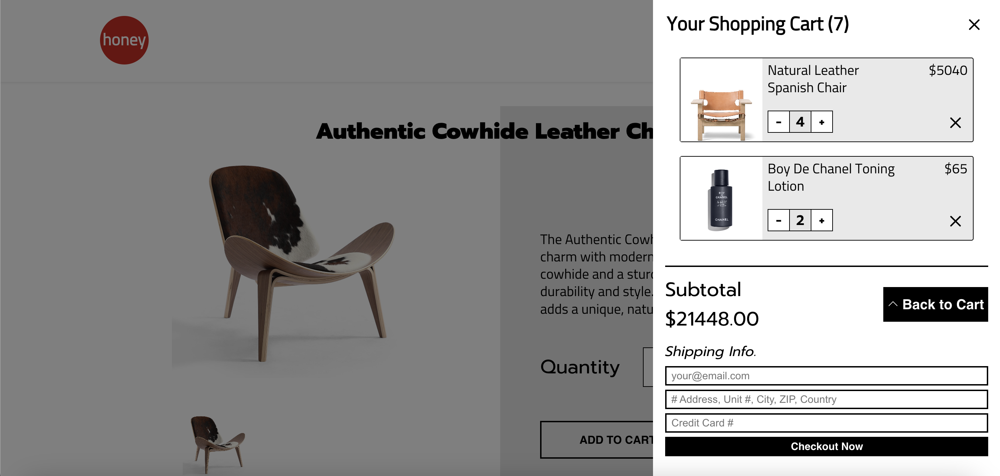

# Microservices E-Commerce Site
Microservices E-Commerce Site is a robust application that provides twenty products that users are able to buy. The application was built using FastAPI, React, MySQL, Docker, Nginx, Uvircorn, AWS S3, AWS CloudFront, AWS ECS, and Railway. You may visit the site here: https://dac235ohvwvlv.cloudfront.net/. 

## Landing Page

This page functions as the landing page where a user can proceed to shop throughout the page. This page was built with React, HTML, and CSS.

## Products we are proud of

This part of the website allows users to shop for some of our best products.  This page was built using React, HTML, and CSS.

## Branding Area

This part of the initial page allows for users to see a small part of what our brand represents and can provide.

## Trending Products

This part of the page allows users to see our trending products.

## Newsletter

Here users can visit other pages about our brand information and subscribe to our newsletter. 

## Categorties Page

This page allows users to search for items by category. 

## Product Page


This page allows users to add a specified number of a given product to the user's cart. Users can see different photos of a product, as well as its description

## Cart


The cart lets user's dynamically change the amount of items in their cart. The number of items and price all change dynamically. 

## Checkout

Here users may put in their checkout ifnormation and get sent an email of their order information. Upon submit, their orders are stored in a MySQL database. Users will be sent a confirmation email regarding their success of their payment, including info. about products bought, total, and other info.

## Try it out
If you'd like to run the site, you must install React. After installation, you may run it locally by performing the following steps:
```sh
# Clone the repository.
git clone https://github.com/DanielRamsgard/e-commerce-frontend

# Navigate to the project directory.
cd e-commerce-frontend

# Run this command to view the site locally
npm run start

# The application runs on 'http://localhost'
```